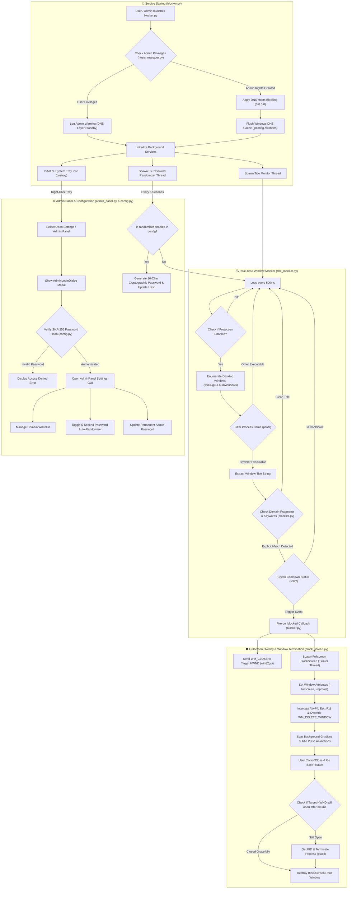

# 1 — Resume Version

# 🛡 Adult Content Blocker for Windows

> A robust, system-level background protection engine designed to block adult content, explicit websites, and live adult IPTV streams across all Windows web browsers without requiring browser extensions.

#project #portfolio #python #security #windows-api

---

## Project Overview

The **Adult Content Blocker for Windows** is an automated desktop security application built to enforce zero-tolerance web content filtering. Combining dual-layer protection—system-level **DNS Hosts File redirection** and a real-time **Browser Window Title Monitor**—the application dynamically inspects open browser tabs every 500ms across 25+ browser process types (`chrome.exe`, `msedge.exe`, `firefox.exe`, etc.). When explicit material or domain triggers are detected, the system immediately terminates offending browser tabs and displays a non-dismissable, animated **fullscreen block screen**.

---

## Tech Stack

- **Core Language**: Python 3.10+
- **GUI & Display Framework**: Tkinter (Dark Theme Architecture, Custom Canvas Animations)
- **Windows System Integrations**: `pywin32` (`win32gui`, `win32con`, `win32process`), `ctypes` (Win32 API & Admin Privilege Elevation)
- **Process & OS Management**: `psutil`, `subprocess` (`ipconfig /flushdns`)
- **System Tray Service**: `pystray`, `Pillow` (PIL image processing for dynamic RGBA shield icons)
- **Security & Cryptography**: `hashlib` (SHA-256 password hashing), `secrets` (Cryptographic 5-second password rotation)

---

## Key Features

- **Dual-Layer Filtering Architecture**:
  - **DNS Hosts Layer**: Maps 3,000+ adult domains directly to `0.0.0.0` in `C:\Windows\System32\drivers\etc\hosts` and automatically flushes Windows DNS cache.
  - **Live Title Inspection Layer**: Monitors visible window handles (`HWND`) every 500ms using Win32 API calls for 150+ adult keywords and live IPTV patterns.
- **Tamper-Resistant Fullscreen Overlay**:
  - Displays an animated, glowing red alert screen upon content detection.
  - Intercepts and suppresses keyboard shortcuts (`Alt+F4`, `Escape`, `F11`) and re-asserts topmost status (`-topmost`) every 500ms.
  - Automatically posts `WM_CLOSE` to the offending browser window handle, terminating the process with `psutil` if unclosed after 300ms.
- **Anti-Bypass & Permanent Protection**:
  - Protection status is locked permanently active once initialized.
  - System tray icon menu omits direct unauthenticated exit options.
- **Dynamic 5-Second Password Randomization**:
  - Includes a background daemon thread that continuously updates the admin password hash using 16-character cryptographic strings every 5 seconds.
- **Password-Protected Control Panel**:
  - Dark-themed Tkinter GUI behind SHA-256 modal authentication for whitelist management and DNS rule configuration.

---

## What Problem It Solves

> Traditional browser extensions can easily be disabled, uninstalled, or bypassed using private/incognito modes and unsupported browsers. 

This application operates at the **operating system level**, catching content regardless of the browser used, incognito mode status, or proxy configuration, providing a tamper-resistant environment for personal self-control and parental oversight.

---

---

# 2 — Crawl Version (Technical Reference)

## `blocker.py`

### **Purpose**
Serves as the main entry point and background service manager. It initializes system tray icons, manages background monitoring threads, handles process shutdown, and launches background password randomization.

### `create_tray_icon()`
Generates a high-resolution 64x64 PIL RGBA image of a red shield icon containing a white cross overlay for display in the Windows notification area.

| Input / Argument | Type | Description |
| :--- | :--- | :--- |
| *None* | `None` | Takes no parameters |

| Output / Return | Type | Description |
| :--- | :--- | :--- |
| `image` | `PIL.Image.Image` | 64x64 RGBA shield icon image object |

### `AdultBlockerApp.__init__()`
Constructs the main application class instance and sets default attributes for window root, tray icon, and monitor handles.

| Input / Argument | Type | Description |
| :--- | :--- | :--- |
| *None* | `None` | Takes no parameters |

| Output / Return | Type | Description |
| :--- | :--- | :--- |
| `self` | `AdultBlockerApp` | Initialized application instance |

### `AdultBlockerApp.on_blocked()`
Callback function triggered when explicit content is detected by `TitleMonitor`. Posts a `WM_CLOSE` message to the browser window handle and opens the fullscreen block window.

| Input / Argument | Type | Description |
| :--- | :--- | :--- |
| `title` | `str` | Detected browser window title text |
| `matched_keyword` | `str` | Specific keyword or domain fragment matched |
| `target_hwnd` | `int` | Win32 window handle (`HWND`) of target browser |

| Output / Return | Type | Description |
| :--- | :--- | :--- |
| *None* | `None` | Returns `None` |

### `AdultBlockerApp.start_background_services()`
Initializes DNS host blocking if elevated as administrator, spawns the title monitor background thread, and starts the 5-second password randomizer thread.

| Input / Argument | Type | Description |
| :--- | :--- | :--- |
| *None* | `None` | Takes no parameters |

| Output / Return | Type | Description |
| :--- | :--- | :--- |
| *None* | `None` | Returns `None` |

### `AdultBlockerApp.show_admin()`
Launches a separate daemon thread to display the password-protected Admin Panel GUI without blocking the system tray event loop.

| Input / Argument | Type | Description |
| :--- | :--- | :--- |
| *None* | `None` | Takes no parameters |

| Output / Return | Type | Description |
| :--- | :--- | :--- |
| *None* | `None` | Returns `None` |

### `AdultBlockerApp.run()`
Builds the system tray menu (`pystray`), attaches event handlers, starts background services, and enters the main tray loop.

| Input / Argument | Type | Description |
| :--- | :--- | :--- |
| *None* | `None` | Takes no parameters |

| Output / Return | Type | Description |
| :--- | :--- | :--- |
| *None* | `None` | Blocks on `pystray.Icon.run()` |

```python
# Entry point initialization snippet from blocker.py
if __name__ == "__main__":
    app = AdultBlockerApp()
    app.run()
```

> [!tip]
> `blocker.py` uses `pystray` to keep the application running continuously in the notification area without occupying space on the Windows taskbar.

> [!warning]
> Running `blocker.py` without Windows Administrator privileges disables DNS hosts file updating, relying solely on window title scanning.

---

## `block_screen.py`

### **Purpose**
Creates an aggressive, always-on-top fullscreen Tkinter warning overlay when explicit material is detected. It overrides window close events, blocks escape hotkeys, and terminates the target browser window.

### `BlockScreen.__init__()`
Initializes window properties, sets up fullscreen flags, binds keyboard override protocols, and triggers background animations.

| Input / Argument | Type | Description |
| :--- | :--- | :--- |
| `root` | `tk.Tk` | Top-level Tkinter root window |
| `blocked_title` | `str` | Title of blocked window |
| `matched_keyword` | `str` | Explicit keyword detected |
| `target_hwnd` | `int` | Win32 window handle (`HWND`) |

| Output / Return | Type | Description |
| :--- | :--- | :--- |
| `self` | `BlockScreen` | Initialized overlay instance |

### `BlockScreen._setup_window()`
Configures Tkinter window attributes (`-fullscreen`, `-topmost`), intercepts `WM_DELETE_WINDOW`, and binds `Alt+F4`, `Escape`, and `F11` keys to break execution.

| Input / Argument | Type | Description |
| :--- | :--- | :--- |
| *None* | `None` | Takes no parameters |

| Output / Return | Type | Description |
| :--- | :--- | :--- |
| *None* | `None` | Returns `None` |

### `BlockScreen._keep_on_top()`
Recursively calls itself every 500ms using `root.after()` to force the overlay window to stay above all system windows.

| Input / Argument | Type | Description |
| :--- | :--- | :--- |
| *None* | `None` | Takes no parameters |

| Output / Return | Type | Description |
| :--- | :--- | :--- |
| *None* | `None` | Returns `None` |

### `BlockScreen._on_close_attempt()`
Event handler that re-asserts topmost focus when a user attempts to force-close the overlay via OS signals.

| Input / Argument | Type | Description |
| :--- | :--- | :--- |
| *None* | `None` | Takes no parameters |

| Output / Return | Type | Description |
| :--- | :--- | :--- |
| *None* | `None` | Returns `None` |

### `BlockScreen._build_ui()`
Constructs the UI layout including glowing canvas border, warning shield emoji, pulsing title text, detected keyword label, and "Close & Go Back" button.

| Input / Argument | Type | Description |
| :--- | :--- | :--- |
| *None* | `None` | Takes no parameters |

| Output / Return | Type | Description |
| :--- | :--- | :--- |
| *None* | `None` | Returns `None` |

### `BlockScreen._pulse_title()`
Animates the title label color between `#ff3333`, `#ff6666`, and `#cc0000` every 500ms.

| Input / Argument | Type | Description |
| :--- | :--- | :--- |
| `label` | `tk.Label` | Reference to title label widget |

| Output / Return | Type | Description |
| :--- | :--- | :--- |
| *None* | `None` | Returns `None` |

### `BlockScreen._animate_bg()`
Cycles canvas background colors across dark red shades every 800ms.

| Input / Argument | Type | Description |
| :--- | :--- | :--- |
| *None* | `None` | Takes no parameters |

| Output / Return | Type | Description |
| :--- | :--- | :--- |
| *None* | `None` | Returns `None` |

### `BlockScreen._close_target_window()`
Sends `WM_CLOSE` signal to target window handle (`HWND`). If the window remains open after 300ms, gets process ID (`PID`) via `win32process` and forcefully kills process via `psutil.Process.terminate()`.

| Input / Argument | Type | Description |
| :--- | :--- | :--- |
| *None* | `None` | Takes no parameters |

| Output / Return | Type | Description |
| :--- | :--- | :--- |
| *None* | `None` | Returns `None` |

### `BlockScreen._dismiss()`
Dismisses the block screen, closes the target browser window, and destroys the Tkinter root instance.

| Input / Argument | Type | Description |
| :--- | :--- | :--- |
| *None* | `None` | Takes no parameters |

| Output / Return | Type | Description |
| :--- | :--- | :--- |
| *None* | `None` | Returns `None` |

### `BlockScreen.show()`
Thread-safe class method that spawns a dedicated daemon thread to launch the block screen overlay loop.

| Input / Argument | Type | Description |
| :--- | :--- | :--- |
| `blocked_title` | `str` | Title of blocked page |
| `matched_keyword` | `str` | Detected keyword fragment |
| `target_hwnd` | `int` | Win32 window handle (`HWND`) |

| Output / Return | Type | Description |
| :--- | :--- | :--- |
| *None* | `None` | Spawns background thread |

```python
# Target window closure logic from block_screen.py
if self.target_hwnd and win32gui.IsWindow(self.target_hwnd):
    win32gui.PostMessage(self.target_hwnd, win32con.WM_CLOSE, 0, 0)
    time.sleep(0.3)
    if win32gui.IsWindow(self.target_hwnd):
        _, pid = win32process.GetWindowThreadProcessId(self.target_hwnd)
        if pid:
            proc = psutil.Process(pid)
            proc.terminate()
```

> [!tip]
> Using `win32gui.PostMessage` with `WM_CLOSE` gracefully asks the browser tab to close, falling back to process termination only if unresponsive.

---

## `title_monitor.py`

### **Purpose**
Performs continuous background monitoring of open desktop windows every 500ms, filtering visible process titles against explicit domain fragments and keywords across 25+ major web browsers.

### `TitleMonitor.__init__()`
Initializes state variables, block cooldown dictionary, and stores the `on_blocked_callback` function reference.

| Input / Argument | Type | Description |
| :--- | :--- | :--- |
| `on_blocked_callback` | `callable` | Function called when explicit content is detected |

| Output / Return | Type | Description |
| :--- | :--- | :--- |
| `self` | `TitleMonitor` | Initialized monitor instance |

### `TitleMonitor.start()`
Sets `_running` flag to `True` and launches the monitoring thread.

| Input / Argument | Type | Description |
| :--- | :--- | :--- |
| *None* | `None` | Takes no parameters |

| Output / Return | Type | Description |
| :--- | :--- | :--- |
| *None* | `None` | Starts background thread |

### `TitleMonitor.stop()`
Sets `_running` flag to `False` to signal loop termination.

| Input / Argument | Type | Description |
| :--- | :--- | :--- |
| *None* | `None` | Takes no parameters |

| Output / Return | Type | Description |
| :--- | :--- | :--- |
| *None* | `None` | Returns `None` |

### `TitleMonitor._get_all_browser_windows()`
Uses `win32gui.EnumWindows` to iterate visible desktop windows, extracting window titles and mapping process IDs to executable names matching `BROWSER_PROCESSES`.

| Input / Argument | Type | Description |
| :--- | :--- | :--- |
| *None* | `None` | Takes no parameters |

| Output / Return | Type | Description |
| :--- | :--- | :--- |
| `results` | `list[tuple[int, str, str]]` | List of `(hwnd, title, process_name)` tuples |

### `TitleMonitor._is_adult_title()`
Evaluates window title string against `ADULT_DOMAIN_FRAGMENTS` and `contains_adult_keyword()`.

| Input / Argument | Type | Description |
| :--- | :--- | :--- |
| `title` | `str` | Window title string |

| Output / Return | Type | Description |
| :--- | :--- | :--- |
| `matched` | `str \| None` | Matched keyword/fragment string or `None` if clean |

### `TitleMonitor._should_trigger()`
Enforces a 3-second cooldown per window title to avoid firing duplicate callbacks for the same open tab.

| Input / Argument | Type | Description |
| :--- | :--- | :--- |
| `title` | `str` | Window title string |

| Output / Return | Type | Description |
| :--- | :--- | :--- |
| `should_trigger` | `bool` | `True` if outside cooldown window, `False` otherwise |

### `TitleMonitor._monitor_loop()`
Main loop executing every 500ms while `_running` is `True`. Checks global enablement settings before scanning active windows.

| Input / Argument | Type | Description |
| :--- | :--- | :--- |
| *None* | `None` | Takes no parameters |

| Output / Return | Type | Description |
| :--- | :--- | :--- |
| *None* | `None` | Infinite loop until stopped |

```python
# Window enumeration callback from title_monitor.py
def enum_callback(hwnd, _):
    if not win32gui.IsWindowVisible(hwnd):
        return
    title = win32gui.GetWindowText(hwnd)
    if not title:
        return
    _, pid = win32process.GetWindowThreadProcessId(hwnd)
    proc = psutil.Process(pid)
    if proc.name().lower() in BROWSER_PROCESSES:
        results.append((hwnd, title, proc.name().lower()))
```

> [!warning]
> Process name checking relies on `psutil.Process(pid).name()`. High-privilege browser processes may require running the script as Administrator to read PID metadata.

---

## `hosts_manager.py`

### **Purpose**
Manages low-level DNS redirection by reading, modifying, and updating the Windows hosts file (`C:\Windows\System32\drivers\etc\hosts`) and flushing local DNS resolution caches.

### `is_admin()`
Queries Win32 API to check if current execution context possesses Windows Administrator rights.

| Input / Argument | Type | Description |
| :--- | :--- | :--- |
| *None* | `None` | Takes no parameters |

| Output / Return | Type | Description |
| :--- | :--- | :--- |
| `is_admin` | `bool` | `True` if elevated, `False` otherwise |

### `request_admin()`
Re-launches current Python script with elevated privileges using Windows `ShellExecuteW` (`runas`).

| Input / Argument | Type | Description |
| :--- | :--- | :--- |
| *None* | `None` | Takes no parameters |

| Output / Return | Type | Description |
| :--- | :--- | :--- |
| *None* | `None` | Exits non-elevated process |

### `read_hosts()`
Reads raw text contents from `C:\Windows\System32\drivers\etc\hosts`.

| Input / Argument | Type | Description |
| :--- | :--- | :--- |
| *None* | `None` | Takes no parameters |

| Output / Return | Type | Description |
| :--- | :--- | :--- |
| `content` | `str` | Full file text content or empty string on error |

### `write_hosts()`
Writes UTF-8 string data directly to the Windows hosts file path.

| Input / Argument | Type | Description |
| :--- | :--- | :--- |
| `content` | `str` | Text content to write |

| Output / Return | Type | Description |
| :--- | :--- | :--- |
| `success` | `bool` | `True` if write succeeded, `False` if permission denied |

### `flush_dns()`
Executes `ipconfig /flushdns` via `subprocess.run` with hidden window flags (`CREATE_NO_WINDOW`).

| Input / Argument | Type | Description |
| :--- | :--- | :--- |
| *None* | `None` | Takes no parameters |

| Output / Return | Type | Description |
| :--- | :--- | :--- |
| *None* | `None` | Returns `None` |

### `remove_existing_blocks()`
Filters out existing content delimited between `# === ADULT CONTENT BLOCKER START ===` and `# === ADULT CONTENT BLOCKER END ===`.

| Input / Argument | Type | Description |
| :--- | :--- | :--- |
| `content` | `str` | Raw hosts file text |

| Output / Return | Type | Description |
| :--- | :--- | :--- |
| `clean_content` | `str` | Text content with blocker sections stripped |

### `apply_blocks()`
Appends 3,000+ domain mappings to `0.0.0.0` inside hosts block markers, writes file to disk, and triggers `flush_dns()`.

| Input / Argument | Type | Description |
| :--- | :--- | :--- |
| *None* | `None` | Takes no parameters |

| Output / Return | Type | Description |
| :--- | :--- | :--- |
| `(success, count)` | `tuple[bool, int]` | Tuple of success status and number of domains written |

### `remove_blocks()`
Strips blocker markers from hosts file and flushes DNS cache.

| Input / Argument | Type | Description |
| :--- | :--- | :--- |
| *None* | `None` | Takes no parameters |

| Output / Return | Type | Description |
| :--- | :--- | :--- |
| `success` | `bool` | `True` if hosts file successfully updated |

### `is_domain_blocked()`
Checks if a specific domain mapping to `0.0.0.0` exists in current hosts file content.

| Input / Argument | Type | Description |
| :--- | :--- | :--- |
| `domain` | `str` | Domain name string |

| Output / Return | Type | Description |
| :--- | :--- | :--- |
| `is_blocked` | `bool` | `True` if mapped to `0.0.0.0` |

### `get_block_status()`
Inspects hosts file and process tokens to return status info dictionary.

| Input / Argument | Type | Description |
| :--- | :--- | :--- |
| *None* | `None` | Takes no parameters |

| Output / Return | Type | Description |
| :--- | :--- | :--- |
| `status` | `dict` | Dictionary containing `active`, `domains_blocked`, and `has_admin` |

---

## `config.py`

### **Purpose**
Handles persistent JSON settings storage (`config.json`), SHA-256 password hashing, domain whitelist entries, and default option fallback logic.

### `load_config()`
Loads `config.json` dictionary from disk, creating default schema if missing or unparseable.

| Input / Argument | Type | Description |
| :--- | :--- | :--- |
| *None* | `None` | Takes no parameters |

| Output / Return | Type | Description |
| :--- | :--- | :--- |
| `data` | `dict` | Configuration options dictionary |

### `save_config()`
Serializes dictionary object to `config.json` with 2-space formatting.

| Input / Argument | Type | Description |
| :--- | :--- | :--- |
| `config` | `dict` | Configuration dictionary |

| Output / Return | Type | Description |
| :--- | :--- | :--- |
| *None* | `None` | Returns `None` |

### `get_setting()`
Retrieves value for specified key from config dictionary.

| Input / Argument | Type | Description |
| :--- | :--- | :--- |
| `key` | `str` | Configuration property key |

| Output / Return | Type | Description |
| :--- | :--- | :--- |
| `value` | `Any` | Setting value or default value |

### `set_setting()`
Updates specified key-value pair and persists changes to disk.

| Input / Argument | Type | Description |
| :--- | :--- | :--- |
| `key` | `str` | Configuration property key |
| `value` | `Any` | Setting value |

| Output / Return | Type | Description |
| :--- | :--- | :--- |
| *None* | `None` | Returns `None` |

### `check_password()`
Computes SHA-256 hash of input string and compares against stored `password_hash`.

| Input / Argument | Type | Description |
| :--- | :--- | :--- |
| `plain_password` | `str` | Password input string |

| Output / Return | Type | Description |
| :--- | :--- | :--- |
| `matches` | `bool` | `True` if hash matches stored value |

### `set_password()`
Hashes new password string using SHA-256 and writes to configuration.

| Input / Argument | Type | Description |
| :--- | :--- | :--- |
| `new_password` | `str` | New plain text password |

| Output / Return | Type | Description |
| :--- | :--- | :--- |
| *None* | `None` | Returns `None` |

### `add_to_whitelist()`
Adds normalized domain string to `whitelist` list in config.

| Input / Argument | Type | Description |
| :--- | :--- | :--- |
| `domain` | `str` | Domain string |

| Output / Return | Type | Description |
| :--- | :--- | :--- |
| *None* | `None` | Returns `None` |

### `remove_from_whitelist()`
Removes domain string from `whitelist` list in config.

| Input / Argument | Type | Description |
| :--- | :--- | :--- |
| `domain` | `str` | Domain string |

| Output / Return | Type | Description |
| :--- | :--- | :--- |
| *None* | `None` | Returns `None` |

### `is_whitelisted()`
Checks if domain exists in whitelist list.

| Input / Argument | Type | Description |
| :--- | :--- | :--- |
| `domain` | `str` | Domain string |

| Output / Return | Type | Description |
| :--- | :--- | :--- |
| `whitelisted` | `bool` | `True` if domain present |

### `get_whitelist()`
Returns current whitelisted domains list.

| Input / Argument | Type | Description |
| :--- | :--- | :--- |
| *None* | `None` | Takes no parameters |

| Output / Return | Type | Description |
| :--- | :--- | :--- |
| `domains` | `list[str]` | List of whitelisted domain strings |

---

## `blocklist.py`

### **Purpose**
Static database storing 3,000+ adult website domains, explicit IPTV streams, 150+ browser title keywords, and adult TLD patterns.

### `get_all_domains()`
Returns deduplicated list of adult domain strings (`ADULT_DOMAINS`).

| Input / Argument | Type | Description |
| :--- | :--- | :--- |
| *None* | `None` | Takes no parameters |

| Output / Return | Type | Description |
| :--- | :--- | :--- |
| `domains` | `list[str]` | List of unique domain strings |

### `get_all_keywords()`
Returns lowercase list of explicit keywords (`ADULT_KEYWORDS`).

| Input / Argument | Type | Description |
| :--- | :--- | :--- |
| *None* | `None` | Takes no parameters |

| Output / Return | Type | Description |
| :--- | :--- | :--- |
| `keywords` | `list[str]` | List of lowercase keyword strings |

### `contains_adult_keyword()`
Evaluates input text against keyword list, returning matched keyword if found.

| Input / Argument | Type | Description |
| :--- | :--- | :--- |
| `text` | `str` | Input string to analyze |

| Output / Return | Type | Description |
| :--- | :--- | :--- |
| `matched` | `str \| None` | Matched keyword string or `None` |

---

## `admin_panel.py`

### **Purpose**
Provides a dark-themed Tkinter GUI interface split into `AdminLoginDialog` (authentication gate) and `AdminPanel` (settings, whitelist management, password updating).

### `AdminLoginDialog.__init__()`
Constructs modal authentication dialog requiring admin password.

| Input / Argument | Type | Description |
| :--- | :--- | :--- |
| `parent` | `tk.Widget` | Parent widget handle |
| `on_success` | `callable` | Callback triggered upon successful authentication |

| Output / Return | Type | Description |
| :--- | :--- | :--- |
| `self` | `AdminLoginDialog` | Dialog window instance |

### `AdminLoginDialog._verify()`
Validates entered password via `config.check_password()`. Calls `on_success` callback if valid.

| Input / Argument | Type | Description |
| :--- | :--- | :--- |
| *None* | `None` | Takes no parameters |

| Output / Return | Type | Description |
| :--- | :--- | :--- |
| *None* | `None` | Returns `None` |

### `AdminPanel.__init__()`
Constructs tabbed settings GUI (`General Protection`, `Whitelist`, `Password & Security`).

| Input / Argument | Type | Description |
| :--- | :--- | :--- |
| `parent` | `tk.Widget` | Parent widget handle |
| `on_exit` | `callable` | Callback handle for application exit |

| Output / Return | Type | Description |
| :--- | :--- | :--- |
| `self` | `AdminPanel` | Settings window instance |

### `open_admin_panel()`
Utility function initializing `AdminLoginDialog` and launching `AdminPanel` upon successful login.

| Input / Argument | Type | Description |
| :--- | :--- | :--- |
| `parent` | `tk.Widget` | Parent window handle |
| `on_exit` | `callable` | Application exit callback |

| Output / Return | Type | Description |
| :--- | :--- | :--- |
| *None* | `None` | Displays dialog |

---

---

# 3 — Logic Diagram


